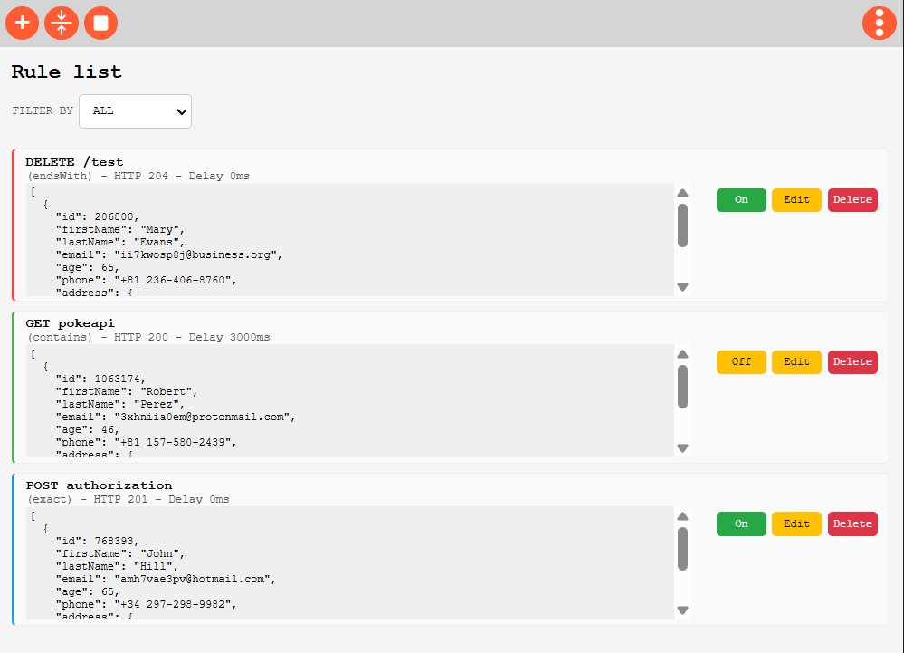

# 🛠️ EZ Mocker ~ HTTP request interceptor

A lightweight, no-dependency Chrome extension that intercepts both `fetch` and `XMLHttpRequest` calls. It enables you to **mock API responses** with custom status codes, headers, delays, and full JSON bodies while your original request still reaches its destination.

> 🚀 Weighs only 100KB and uses chromium-based APIs.

---

## 📸 How it looks and feels?

Ez and sexy. 3 main buttons, 2 sections:

### 🎯 Create Custom Rules Easily

### 📋 View, Edit, Enable/Disable Your Rules

---

## ⚙️ Key Features

- ✅ Intercepts **`fetch`** and **`XMLHttpRequest`**
- 🧪 Mock:
  - **JSON response body**
  - **Status codes**
  - **Response headers**
  - **Delay (in milliseconds)** (Only available with fetch, sorry, shit's hard enough)

- 🔍 Powerful URL filtering:
  - `INCLUDES`, `STARTS WITH`, `ENDS WITH`, or `EXACT MATCH`

- 🧭 Match by:
  - **HTTP method**
  - **Status code**
  - **Alias**

- 💀 Easily import and export your rules as a JSON collection
- 🧩 Built without any library dependencies, just loads of caffeine
- ⚡ Ultra lightweight — just **100KB**
- 🧠 FREE! Your limit is chrome storage and the power of will, not even sure what's the limit
---

## 🧑‍💻 Use Case Examples

- Simulate backend responses during frontend development
- Test how your app handles failed requests (e.g., 500, 404)
- Quickly switch between different mock scenarios

---

## 🛠️ Installation

1. Download or clone this repository.
2. Go to `chrome://extensions/` in your browser.
3. Enable **Developer Mode** (top right).
4. Click **Load unpacked** and select the extension folder.
5. Why isn't this in the store? Not gonna pay a cent.

---

## 🧾 License

MIT License. Free to use and modify. Limit interceptors to 5-12 request as i've seen across multiple extensions should be considered a crime so I built this out of spite. Take care y'all, until AGI replace us.
